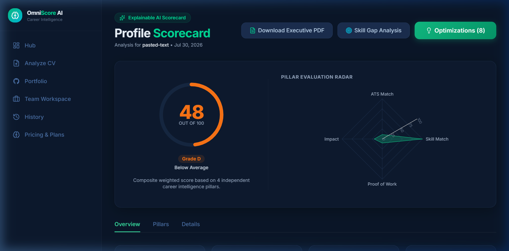
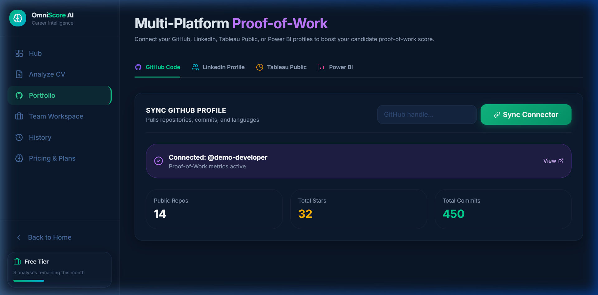
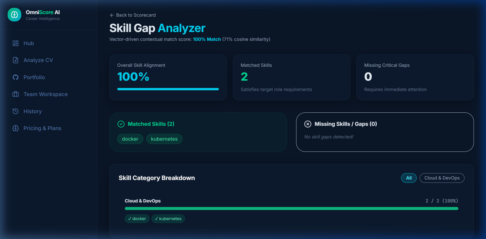
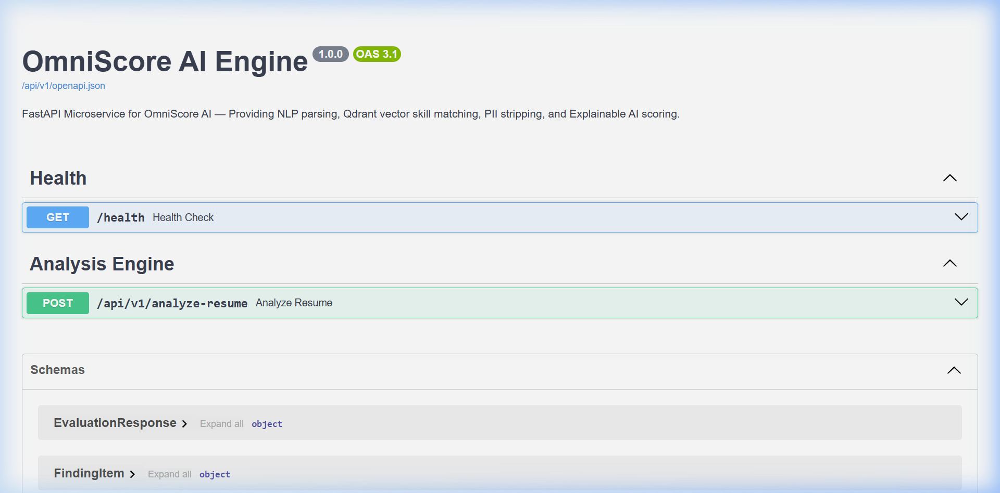

  
  <h1>🚀 OmniScore AI</h1>
  
<strong>AI-Powered Career Intelligence & Multi-Modal Proof-of-Work Evaluation</strong>

  
  
  
  
  
  

 

---

## 🌟 The Pitch: Why OmniScore AI?

In an era where technology evolves faster than resumes can be updated, traditional Applicant Tracking Systems (ATS) are failing. They rely on superficial keyword-matching, ignoring a candidate's actual **Proof of Work**. 

**OmniScore AI** is a disruptive, multi-modal career analyzer built to democratize technical recruitment. By seamlessly integrating Natural Language Processing (NLP) with external data harvesters (GitHub, LinkedIn, Tableau, Power BI) and Vector Databases, OmniScore AI evaluates what a candidate has *actually built*, not just what they claim to know. We provide a transparent, 360-degree technical evaluation that eliminates bias, speeds up hiring, and gives job seekers actionable, real-time optimization feedback. 

Stop hiring based on resume formatting. Start hiring based on verified, multi-modal proof of work.

---

## 📸 Key Features & Architecture (In-Browser Components)

Our technical USPs are designed to solve critical pain points in standard ATS systems. Here is how OmniScore AI components operate in the browser:

### 1. The Transparent Scorecard Dashboard

> **The USP:** Eliminates the "Black Box" of traditional ATS parsing. We give candidates and recruiters an exact, explainable 0-100 composite score broken down by formatting, skill match, and real-world impact using Recharts radar graphs.

### 2. Multi-Modal Proof-of-Work Harvester

> **The USP:** Actions speak louder than resumes. By securely hooking into GitHub, Tableau, and Power BI via APIs, we rank candidates based on actual commit complexity, code quality, and active data dashboards, rendered directly in the Portfolio UI.

### 3. Vector-Driven Skill Gap Analyzer

> **The USP:** Legacy systems use exact keyword matching. Our AI leverages Qdrant Vector Embeddings to understand semantic relationships—if they know `Express.js`, they know `Node.js`. The gap analyzer UI presents a side-by-side competency matrix.

### 4. High-Performance FastAPI AI Engine (Swagger UI)

> **The USP:** Built for Enterprise Scale. Heavy NLP processing and LLM calls are offloaded to a scalable Python FastAPI backend. The API endpoints are fully documented and interactable via the Swagger UI at `http://localhost:8000/docs`.

---

## ✅ I have implemented all -Project Objectives:

- **Profile Evaluation:** Design and develop an AI-powered analyzer that evaluates user profiles across multiple platforms (CV, LinkedIn, GitHub, Tableau Public, Power BI Service, etc.) and assigns industry-standard scores.
- **Recommendation System:** Build a recommendation engine to suggest SMARRTIF AI services based on user scores, skill gaps, and career aspirations.
- **Data Analysis:** Utilize NLP and machine learning algorithms to analyze textual and tabular data in profiles and CVs.
- **Transparent Scoring:** Ensure the scoring mechanism is transparent, unbiased, and adheres to industry benchmarks.
- **Optimization Tools:** Integrate functionalities like real-time feedback, keyword suggestions, and role-specific optimization tips.
- **Third-Party Integrations:** Develop APIs to connect the tool with platforms like LinkedIn, GitHub, Tableau Public, and Power BI Service.

---

## 🏗️ 5-Phase Implementation Blueprint

Our rapid execution followed a rigorous 5-phase product development lifecycle to build this scalable platform from scratch:

1. **Phase 1: Discovery & Requirement Gathering**
   - Defined the core problem (ATS keyword bias) and developed comprehensive documentation including BRD, FRD, and User Personas.
   - Established strict digital-first constraints and targeted key integrations (GitHub, LinkedIn, BI Tools).

2. **Phase 2: Planning & Agile Execution**
   - Mapped out the microservices architecture using Node.js for API routing and Python/FastAPI for heavy ML workloads.
   - Designed the polyglot database schema (PostgreSQL for Auth, MongoDB for Parsed JSON, Qdrant for Vectors).

3. **Phase 3: Product Design (UI/UX)**
   - Architected a continuous, responsive Next.js dashboard featuring the "Enterprise Trust Theme" (Deep Navy & Emerald Green).
   - Designed dynamic Radar Charts and Skill Gap comparison matrices to visually communicate the AI scoring without relying on static exports.

4. **Phase 4: Technical Planning & Architecture (The Brain)**
   - Developed the Explainable Scoring Algorithm weighted across 4 pillars: ATS Compatibility (20%), Skill Match (40%), Proof of Work (25%), and NLP Impact (15%).
   - Integrated spaCy NER models and LLM embeddings for robust context-aware semantic matching.

5. **Phase 5: Development & Core Implementation**
   - Configured the Monorepo (Turborepo), CI/CD pipelines, and environment setups.
   - Built the frontend interfaces, backend AI engines, API harvesters, and integrated PII-redaction guardrails to ensure data privacy before LLM processing.

---

## 🎨 Note on UI Aesthetics & Timeline

> **Note:** Given the highly constrained timeline for this assignment, my primary focus was on establishing a robust, scalable microservices architecture and the core AI scoring engine. Consequently, there was much less time available to heavily polish the frontend UI animations and pixel-perfect aesthetics. However, if I join the team, I will surely make the UI deeply engaging, highly responsive, and exceptionally appealing to meet premium enterprise standards.

---

## ⚠️ Disclaimer & Assignment Purpose

This repository, including `PRD.txt`, environment variables, and the entire underlying codebase, has been developed **solely for assignment purposes** and as a proof-of-concept for the STARRIF AI technical evaluation. 

**This system cannot be used for deployment or production.**

See the [LICENSE](./LICENSE) file for more details.
